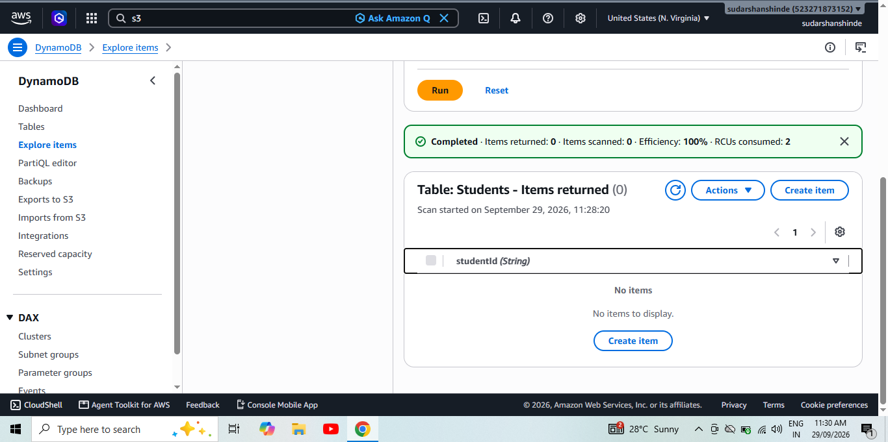
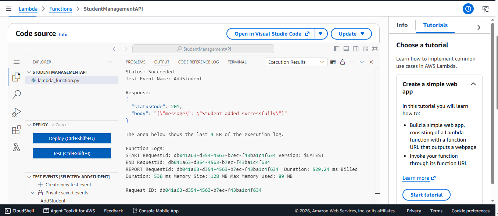
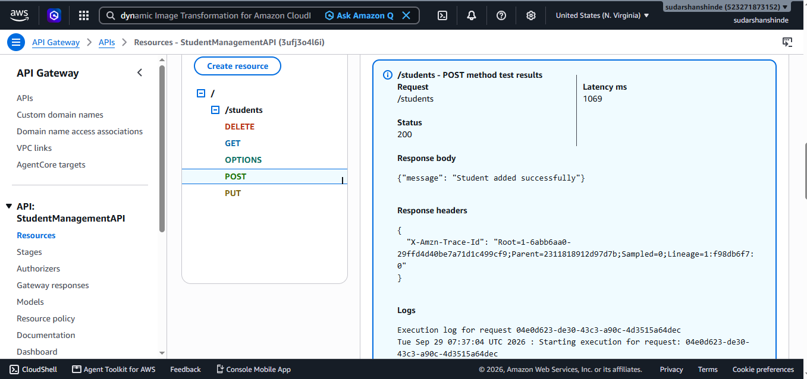

# AWS Serverless Student Management API

## 1. Project Overview

This project implements a serverless Student Management API using AWS Lambda, Amazon API Gateway, and Amazon DynamoDB.

The API supports:
- POST — Add student
- GET — View students
- PUT — Update student
- DELETE — Delete student

---

## 2. AWS Services Used

### Amazon DynamoDB
- Table Name: `Students`
- Partition Key: `studentId`
- Key Type: String

### AWS Lambda
- Function Name: `StudentManagementAPI`
- Runtime: Python 3.x
- IAM Role: `StudentManagementLambdaRole`

### Amazon API Gateway
- API Type: REST API
- Resource: `/students`
- Stage: `prod`

### Amazon CloudWatch
Used for Lambda execution logs and troubleshooting.

---

## 3. Architecture

```text
                  HTTP Request
                       |
                       v
              +------------------+
              |  API Gateway     |
              |  REST API        |
              |    /students     |
              +--------+---------+
                       |
                       v
              +------------------+
              |   AWS Lambda     |
              | StudentManagement|
              |       API        |
              +--------+---------+
                       |
                       v
              +------------------+
              | Amazon DynamoDB  |
              |    Students      |
              +------------------+

       POST   -> Add Student
       GET    -> View Students
       PUT    -> Update Student
       DELETE -> Delete Student
```

---

## 4. API Configuration

Base API URL:

`https://3ufj304l6i.execute-api.us-east-1.amazonaws.com/prod`

Resource:

`/students`

Methods:
- `POST /students`
- `GET /students`
- `PUT /students`
- `DELETE /students`

Lambda proxy integration was enabled for the API methods.

---

## 5. API Operations

### POST — Add Student

Request body:

```json
{
  "studentId": "S001",
  "name": "Rahul",
  "course": "MCA",
  "age": 22
}
```

Expected response:

```json
{
  "message": "Student added successfully"
}
```

### GET — View Students

No request body is required.

Example response:

```json
[
  {
    "studentId": "S001",
    "name": "Rahul",
    "course": "MCA",
    "age": 22
  }
]
```

GET was successfully tested with HTTP Status `200`.

### PUT — Update Student

Request body:

```json
{
  "studentId": "S001",
  "name": "Rahul Updated",
  "course": "MCA",
  "age": 23
}
```

Expected response:

```json
{
  "message": "Student updated successfully"
}
```

### DELETE — Delete Student

Request body:

```json
{
  "studentId": "S001"
}
```

Expected response:

```json
{
  "message": "Student deleted successfully"
}
```

---

## 6. Testing Results

| Method | Operation | Result |
|---|---|---|
| POST | Add student | Successful |
| GET | View students | Status 200 |
| PUT | Update student | Successful |
| DELETE | Delete student | Successful |
| GET | Final verification | Successful |

The final GET verification confirmed that the deleted student record was no longer returned.

---

## 7. Screenshots


### DynamoDB Students Table



###  Lambda Function / POST Test



###  API Gateway POST Test



###  — API Gateway GET Test 


###  API Gateway PUT Test


###  API Gateway DELETE Test


### Final GET Verification


### Final GET Record


---

## 8. Lambda Logic

The Lambda function reads the HTTP method supplied by API Gateway.

- POST writes a new student item to DynamoDB.
- GET scans the Students table and returns the records.
- PUT updates an existing student using `studentId`.
- DELETE removes a student using `studentId`.

The GET response uses JSON serialization compatible with DynamoDB numeric values.

---

## 9. Deployment Notes

1. Created the DynamoDB `Students` table.
2. Created the Lambda IAM role.
3. Created the `StudentManagementAPI` Lambda function.
4. Connected Lambda with DynamoDB.
5. Created an API Gateway REST API.
6. Created the `/students` resource.
7. Added POST, GET, PUT, and DELETE methods.
8. Enabled Lambda proxy integration.
9. Deployed the API to the `prod` stage.
10. Tested all CRUD operations.

---

## 10. Conclusion

The serverless Student Management API was successfully implemented using AWS Lambda, Amazon API Gateway, and Amazon DynamoDB.

All four CRUD operations were tested:

**Create → POST**

**Read → GET**

**Update → PUT**

**Delete → DELETE**

The project demonstrates a working serverless API architecture using AWS services only.
